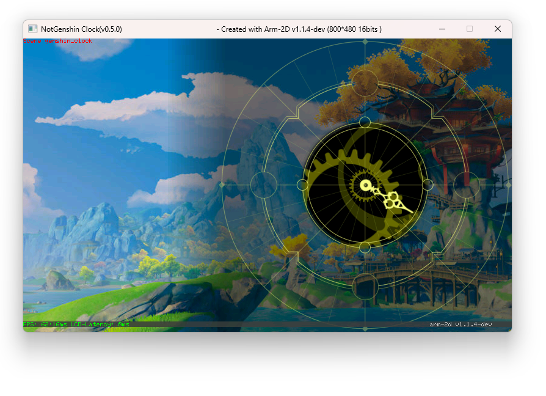
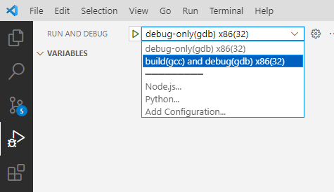

# NotGenshin Clock (v0.6.0)
A Genshin Impact style of clock face created with [arm-2d](https://github.com/ARM-software/Arm-2D)

 

### Disclaimer:

Apart from the background image, which is derived from a game screenshot, this open-source project does not directly utilize any resource files from Genshin Impact. All materials necessary for the clock face were created by myself, yet unavoidably reference the original design of Genshin Impact. The copyright for these designs belongs to the original game company. 

The image materials involved in this open-source project, that is, the converted pixel array source code files (stored in the `genshin_clock/resources` directory), are **NOT** to be used for any commercial purposes and are solely for open-source and learning purposes. This rule supersedes the Apache 2.0 License that this project uses. 

The rest of the source code in this project adheres to the Apache 2.0 License.


## How to Build


### 1. Clone the Repository

First, you need to clone the project to your local machine. You can do this by running the following command in your terminal:

```bash
git clone --recursive https://github.com/GorgonMeducer/NotGenshinClock.git
```

The `--recursive` option is used to clone all the submodules included in the project.

### 2. Install GCC (mingw32)

Next, you need to download and install GCC. You **MUST** download the [latest mingw32](https://github.com/niXman/mingw-builds-binaries/releases/). For example [i686-13.1.0-release-win32-dwarf-ucrt-rt_v11-rev1.7z](https://github.com/niXman/mingw-builds-binaries/releases/download/13.1.0-rt_v11-rev1/i686-13.1.0-release-win32-dwarf-ucrt-rt_v11-rev1.7z)

Unzip the package and copy it to your desired location. 

**NOTE**: Make sure you have correctly set the **PATH** variable in windows environment for GCC. After installation, you may need to restart your computer to ensure the new environment variable settings take effect.

 


### 3. Open the Project

Finally, you need to open the project in VS Code. You can do this by choosing "**Open Folder**" from the File menu in VS Code, and then selecting the folder of the `NotGenshinClock` project that you cloned.

In "**Run and Debug**" panel, you can run the project via "**build and run x86(32)**" or you can press "**F5**" to launch a debug session.

 


Now, you should be ready to start using the `NotGenshinClock` project. If you encounter any issues, feel free to ask for help.

Enjoy.
