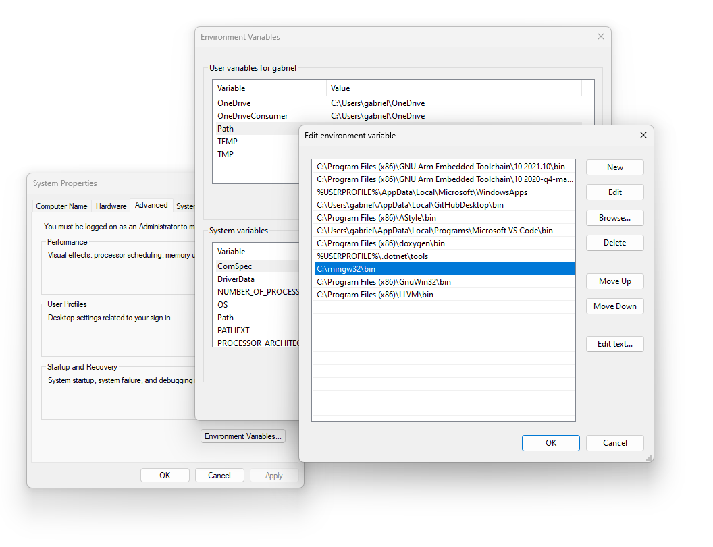
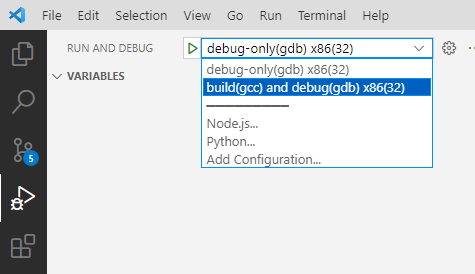
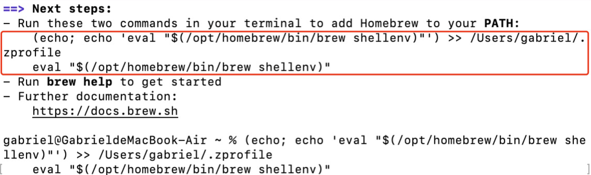
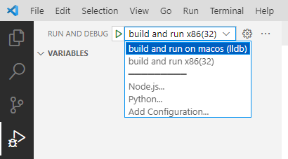

# Arm-2D Demo for Events
This is a GUI demo created with [arm-2d](https://github.com/ARM-software/Arm-2D). **You can use this project as a template for arm-2d development on PC (e.g. Windows, Linux and MacOS).**


## How to Build

This example project currently support Windows, Linux and MacOS. Please follow the corresponding guidance for your environment.

### 1 For Windows

#### 1.1 Clone the Repository

First, please clone the project to your local machine. You can do this by running the following command in your terminal:

```bash
git clone -b IIR-Blur --recursive https://github.com/GorgonMeducer/NotGenshinClock.git
```

The `--recursive` option is used to clone all the submodules included in the project.


#### 1.2 Install GCC (mingw32) and Make

Second, please 

- download and install GCC. You **MUST** download the [latest mingw32](https://github.com/niXman/mingw-builds-binaries/releases/). For example, [i686-13.1.0-release-posix-dwarf-ucrt-rt_v11-rev1.7z](https://github.com/niXman/mingw-builds-binaries/releases/download/13.1.0-rt_v11-rev1/i686-13.1.0-release-posix-dwarf-ucrt-rt_v11-rev1.7z) Unzip the package and copy it to your desired location. 
- [download](https://gnuwin32.sourceforge.net/packages/make.htm) and install Make.

**NOTE**: Ensure you have correctly set the **PATH** variable in the Windows environment for GCC and Make. After installation, you may need to restart your computer to ensure the new environment variable settings take effect.

 


#### 1.3 Open the Project

Finally, please open the project in VS Code. You can do this by choosing "**Open Workspace from File**"  in the File menu in VS Code and then selecting the workspace file `Application.code-workspace` in the `NotGenshinClock` folder that you have just cloned.

In "**Run and Debug**" panel, you can run the project via "**build and run x86(32)**" or you can press "**F5**" to launch a debug session.

 


### 2 For Linux

#### 2.1 Clone the Repository

First, please clone the project to your local machine. You can do this by running the following command in your terminal:

```bash
git clone -b Demo-for-Events-2023 --recursive https://github.com/GorgonMeducer/NotGenshinClock.git
```

The `--recursive` option is used to clone all the submodules included in the project.


#### 2.2 Install the required components

Second, please install the required modules with the following command:

```sh
sudo apt-get update && sudo apt-get install -y build-essential libsdl2-dev
```


#### 2.3 Open the Project

Finally, please open the project in VS Code. You can do this by choosing "**Open Workspace from File**"  in the File menu in VS Code and then selecting the workspace file `Application.code-workspace` in the `NotGenshinClock` folder that you have just cloned.

In "**Run and Debug**" panel, you can run the project via "**build and run x86(32)**" or you can press "**F5**" to launch a debug session.

 


### 3 For MacOS

#### 3.1 Clone the Repository

First, please clone the project to your local machine. You can do this by running the following command in your terminal:

```bash
git clone -b Demo-for-Events-2023 --recursive https://github.com/GorgonMeducer/NotGenshinClock.git
```

The `--recursive` option is used to clone all the submodules included in the project.


#### 3.2 Install the homebrew and sdl2

Second, please open the terminal in MacOS and [install the homebrew](https://brew.sh/) with the following command:

```sh
/bin/bash -c "$(curl -fsSL https://raw.githubusercontent.com/Homebrew/install/HEAD/install.sh)"
```

After a successful installation, you should find an important message on the terminal that is similar to the following:



Please copy the part in the red box and paste to the shell to "**add Howbrew to your PATH**". 

**NOTE**: Your command line will be different from mine as it contains the user name of the machine. 


After that, please install sdl2 with the following command:

```sh
brew install sdl2
```


#### 3.3 Open the Project

Finally, please open the project in VS Code. You can do this by choosing "**Open Workspace from File**"  in the File menu in VS Code and then selecting the workspace file `Application.code-workspace` in the `NotGenshinClock` folder that you have just cloned.

In "**Run and Debug**" panel, you can run the project via "**build and run on macos (lldb)**" or you can press "**F5**" to launch a debug session.

 


Now, you should be ready to start using the `NotGenshinClock` project. If you encounter any issues, feel free to ask for help.

Enjoy.
